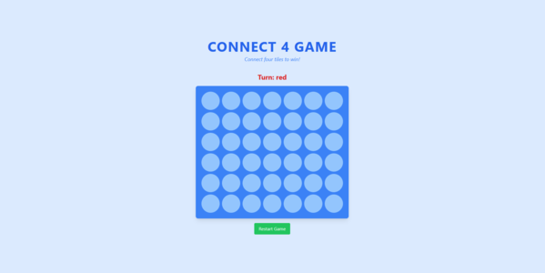

# Connect 4 - React Game

A classic Connect 4 game implemented with React and styled with Tailwind CSS. Enjoy the classic strategy game where two players compete to connect four tokens of the same color in a line.



## 🎮 Features

- Modern and responsive user interface
- Smooth token drop animations
- Automatic win detection
- Current turn indicator
- Score system
- Game reset button
- Responsive design for mobile and desktop devices

## 🛠️ Technologies Used

- React.js
- Tailwind CSS
- Typescript

## 📋 Prerequisites

Before starting, make sure you have installed:

- Node.js (version 14 or higher)
- npm or yarn

## 🚀 Installation

1. Clone the repository:
```bash
git clone https://github.com/aitorortega03/connect-4-game.git
```

2. Navigate to the project directory:
```bash
cd connect-4-game
```

3. Install dependencies:
```bash
npm install
# or
yarn install
```

4. Start the development server:
```bash
npm run dev
# or
yarn dev
```

5. Open [http://localhost:5173](http://localhost:5173) in your browser to view the application.

## 🎯 How to Play

1. Game starts with Player 1 (red tokens)
2. Click on any column to drop a token
3. Tokens will fall to the lowest available position
4. Players take turns
5. Win by connecting 4 tokens of the same color in:
   - Horizontal
   - Vertical
   - Diagonal

## 🌐 Live Demo

Experience the game live at: [https://connect-4-game-aitorortegadev.netlify.app/](https://connect-4-game-aitorortegadev.netlify.app/)

## 🏗️ Project Structure

```
connect4-react/
├── src/
│   ├── components/
│   │   ├── Board.tsx
│   │   ├── GameStatus.tsx
│   │   ├── GameInfo.tsx
│   │   └── ResetButton.tsx
│   ├── utils/
│   │   └── utils.ts
│   ├── App.jsx
│   └── main.jsx
├── public/
├── index.html
└── package.json
```

## 🤝 Contributing

Contributions are welcome. For major changes, please open an issue first to discuss what you would like to change.

1. Fork the project
2. Create your feature branch (`git checkout -b feature/AmazingFeature`)
3. Commit your changes (`git commit -m 'Add: new feature'`)
4. Push to the branch (`git push origin feature/AmazingFeature`)
5. Open a Pull Request


## ✍️ Author

Aitor Ortega - [@aitorortega03](https://github.com/aitorortega03)

## 🎉 Acknowledgments

- Inspired by the classic Connect 4 game
- Thanks to the React and Tailwind CSS communities for their excellent tools and documentation

---

⭐️ If you liked this project, don't forget to give it a star on GitHub!